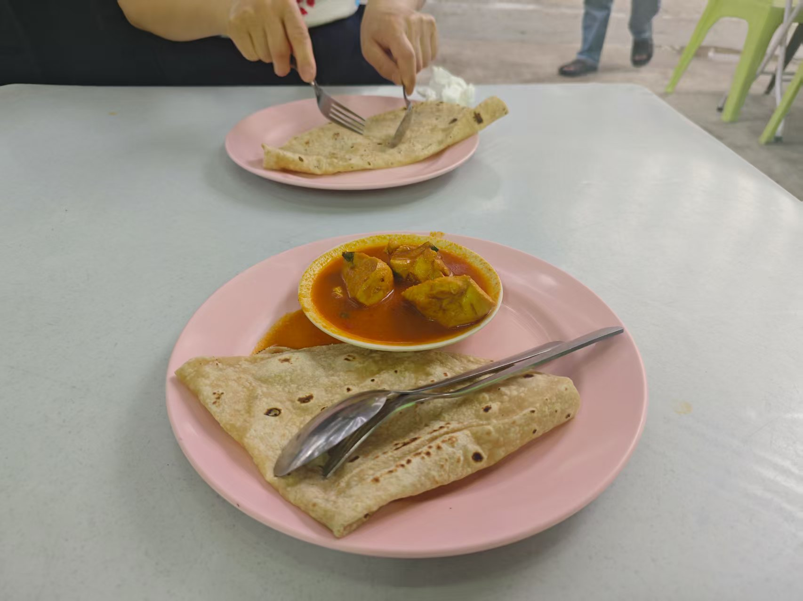
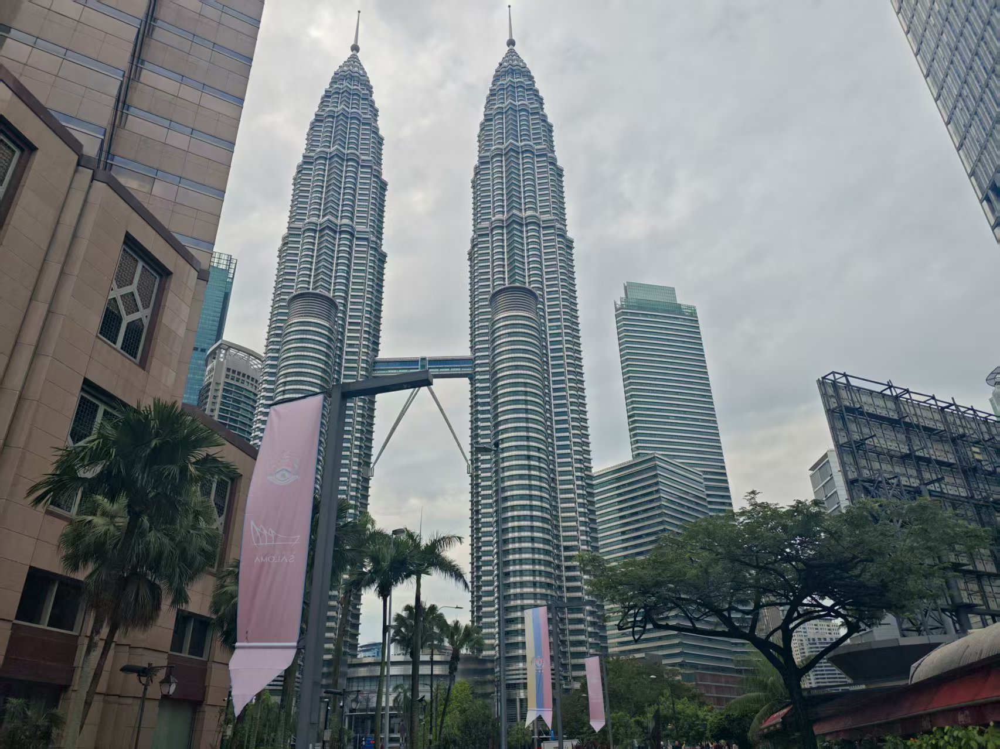
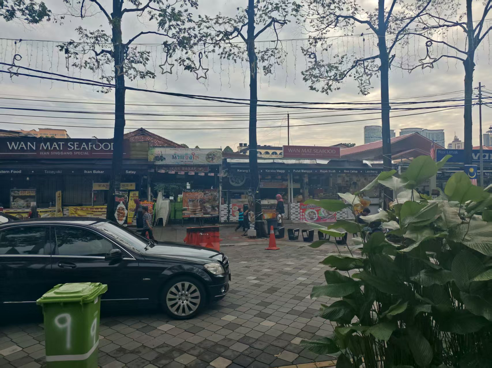
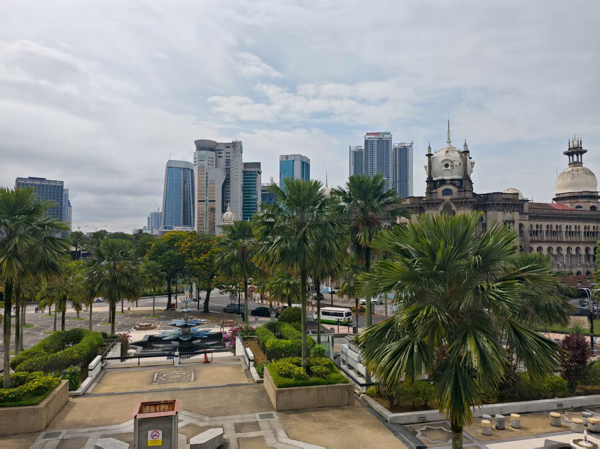
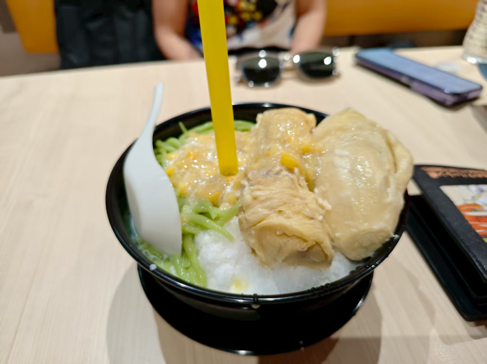
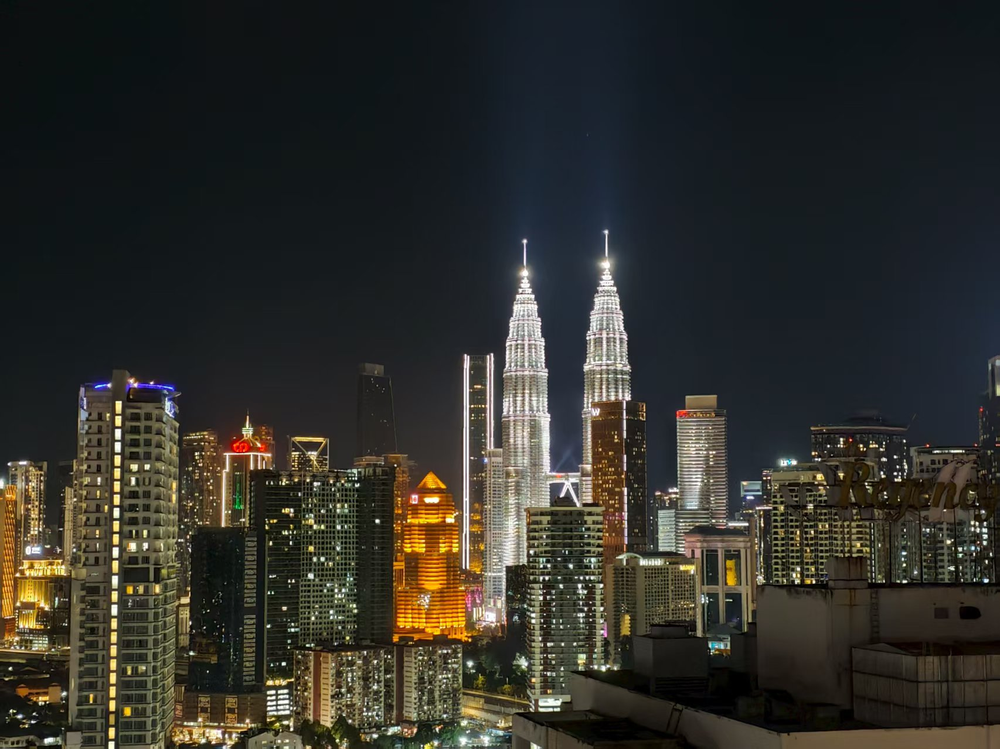

## 青年节与吉隆坡
### 5.4 晴转雷阵雨 吉隆坡

#### 早餐和上午

早上起来，我们开始了在吉隆坡的真正意义上的第一日行程。从酒店 check out 后，我们打算先把行李寄存在第二晚的酒店。途中，我们遇到了一群跑马拉松的人。在街边，我们找了一家小店，尝试了独特的印度早餐，点了印度烤饼、咖喱鸡肉酱和 kopi o（kopi是当地对咖啡的称呼，后来才知道“o”是不加奶的意思）。印度烤饼非常蓬松，咖喱鸡肉有些柴，但咖啡甜得像糖水——马来西亚是一个极度嗜糖的国家。

上午，我们原本计划先去吉隆坡的占美清真寺，但用谷歌地图一查，才发现它要十点才开门。我临时改变了行程，决定先去不远处的城中城公园，步行前往。多云的天气有些闷热，路上随处可见棕榈树和其他热带植物。一路上，我们经过了气势恢宏的双子塔、核心地段的高档酒店、造型独特的花蕊状隧道（隧道顶部层层堆叠酷似卷起来的花蕊），也看到了朴素破旧的木棚小餐馆、臭气熏天的后巷、城中的墓地，甚至还有半裸上身、下身穿着破布的苦行僧人。天气炎热，我很快就汗流浃背，但这丝毫不影响我高涨的徒步兴致。

自从日本之旅开始，城市徒步就俨然成为了我“特种兵旅行”中不可或缺的一环。我爱每一座城市的大街小巷，爱它的繁华与落寞，爱骄阳下璀璨的地标，也爱暗淡的巷尾深处的乞求。光鲜与挣扎，所有的生活方式构成了一座城市的全部。

城中城公园建设得很完善，配套设施齐全，有常见的单双杠、滑梯，还有喷水雕塑和慢跑道。许多孩子和家长在这里嬉戏玩耍，但这座公园虽然精致，却并未给我留下深刻印象，它仿佛可以出现在世界上任何一个略发达的城市的角落，缺乏独特的韵味。

随后，我们顶着烈日，决定步行前往独立广场。在城市中漫步总是充满乐趣，我乐此不疲。独立广场很空旷，中间是大片翠绿的草坪，人烟稀少。标志性建筑是广场中央的高塔和高高飘扬的马来西亚国旗。旁边的钟楼是典型的欧式风格，与天津的钟塔颇为相似。四周也都是低矮的洋楼，回忆起来仍觉得十分有趣。或许也可以称为是殖民地风情，而在这一片洋楼中修建这么一座独立广场，也确实独有匠心。

#### 清真寺和文化体验
从独立的广场出来后，我们准备步行去不远处的国家清真寺。然而，谷歌地图显示今天不开放。失落之余，我们在路上闲逛，偶遇了建筑风格独特的国家纺织博物馆。我们兴致勃勃地进去逛了一小圈。馆内介绍全是英文，但并不难理解。馆内冷气开得很足，展示了各种丝制的、色彩鲜艳的长袖长裤服饰，很像中国傣族和泰国的传统服饰，想必是热带地区的特色。我对马来西亚独特的金丝织物产生了兴趣，猜测它可能是当地华人文化的一部分。

随后，我们步行去了占美清真寺。在吉隆坡的大街小巷，几乎所有本地女性都穿着罩袍，伊斯兰教在这里占据了主导地位，马来西亚是穆斯林国家。清真寺的设计宏伟，但并非采用传统的圆顶，而是十分方正，乍一看甚至可能被误认为是体育馆。祷告大厅在二楼，整个建筑是架高的结构。穆斯林可以从四周的楼梯进入祷告，但游客必须走专门的正门和参观路线，女性必须穿罩袍，男性也不能有裸露的皮肤。无论男女，进入清真寺都必须脱鞋。伊斯兰教文化是马来西亚文化中非常重要的一部分，可以说它从根本上塑造了这里的文化。清真寺的道路中间是水池，有喷泉。祷告大厅可供数万人同时祈祷，所有人都肩并肩跪在地上。一位穿着罩袍的老年女性双手合十向我行礼，随后向我介绍道，在吉隆坡，人们会朝向西方——圣城麦加的方向祈祷，全世界的穆斯林在祷告时都会如此。我们去的时候不是礼拜日，大厅空空的，两三个人跪下地下祈祷，另有几个人在睡觉。我们离开大厅，一楼大部分的展览馆（宣传伊斯兰教的）已经关闭了，一些教室里正在上宗教相关课程。拿上鞋后，我们便离开了。

我看到茨厂街和中央市场不远，便打算走过去吃午饭。中央市场是专门卖玻璃和其他纪念品的小商街。茨厂街则是吉隆坡的唐人街，游客熙熙攘攘，走动起来颇为困难。我在一家排队很长的小摊买了一杯豆浆凉粉，冰凉的豆浆非常解暑，凉粉的口感和味道都像国内奶茶里的仙草。因为人太多，我决定不在那里吃饭。于是我导航了一家附近的餐厅，路上偶遇了一家卖白切鸡的港式茶餐厅，菜单很是诱人，我便改变主意，点了一份白切鸡。翠绿的葱花水灵灵的躺在雪白的鸡皮和鸡肉上，餐盘旁配有清甜的酱汁，特色的鸡油饭上泛着薄薄一层的金黄色油光，味道非常不错。

#### 永远爱甜点！
我心心念念网上推荐的榴莲甜品，于是找了一家甜品店尝试了特色的榴莲煎蕊。煎蕊似乎是一种源自中国的甜品，类似炒米的咸味绿色长条状食物。马来西亚人用榴莲改良了它：一份榴莲煎蕊先用刨冰打底，佐以咸味的玉米罐头，再浇上一层椰奶，最后放上煎蕊和榴莲。煎蕊配玉米的第一口是咸的，让我有些难以接受。但很快，我就尝到了香甜软糯如冰淇淋般的榴莲果肉和椰奶刨冰，瞬间打消了退钱的念头。我开始仔细审视这碗甜品，总体来说，它无疑是优秀的，但这主要归功于榴莲和椰奶冰，煎蕊和玉米的加入显得有些“横生枝节”了。

在旅行开始前，我下载了小红书，抱着尝试的态度从中获取旅行资讯。实践证明，部分资讯确实有用，信息量远大于其他任何软件。但信息质量参差不齐，很难分辨哪些是广告。例如，几乎所有帖子都推荐的这家店的榴莲煎蕊，我竟是在吃完后才在评论区得知它是咸的——而众多推广帖无一提及，它是否适合大部分人的口味，是否适合无理由的向所有人推荐，还有待商榷。

我们在店里度过了酷热的正午，下午打车前往小印度。十分钟前还晴朗的天空，突然下起了大雨，出租车的车窗被雨水剧烈冲刷着。正当我准备改变行程时，雨又戛然而止。我们甚至还没下车，热带雨林气候果然神奇。

小印度实际上是一条印度风格的商店街，但我觉得索然无味，下车后立刻打了另一辆车直奔心心念念的粉红清真寺。不巧的是，由于在小印度耽搁了时间，清真寺只剩一个小时就要关门了。我决定先去河对岸的最佳观赏点。然而，我又订错了位置，只好再打一辆车。

#### 摄影与创作
但是，我们错订的街道却异常美丽，两旁椰树成行，绿草如茵。这立刻打消了因导航错误而产生的烦躁。很快，另一辆车把我们送到了粉红清真寺。河水清澈，波光荡漾，由粉红色玫瑰岩建造的清真寺在白云下熠熠生辉，尽情展示着它的魅力。淡粉色的石基方正而富有几何美感，粉红色的圆形穹顶上绘制着曼妙的图案，点缀着流畅几何线条的小窗。这一刻，它不再是死板的宗教建筑，而是充满活力、异域风情又承载着幻梦的魔法城堡。它是凝滞的文明瑰宝，又是青春灵动的艺术。

我正踩在赤道以北一点的土地上。赤道线就在我的脚下，从我的脚下溜过，穿越无穷无尽的大海又翻越崇峻的高山后重新在我的脚下交汇。热带的夏日永不熄灭，热带的太阳永不落下，热带的色彩永不褪去，热带的心脏永远年轻。
<figure>
  
  <figcaption style="text-align: center; color: gray; font-size: 0.9em;">
    庄严对称的粉红清真寺，富有层次感的云彩，水面波光粼粼的倒影，恰当的前景。我认为它确实是审美意义上的优质作品。
  </figcaption>
</figure>
我是在回程的飞机上创作游记的，舟车劳顿，周围人大多睡去。写到这里，我的耳机中又传出我爱的那首“Forever young”，深情的歌词唱道“So many dreams swingin’ out of the blue”。我不知道这段回忆会保存多久，也不知道我的照片会不会被我反复观看，更不知道我能否永远年轻。但当我再次听到这首歌，我似乎又静静地坐在了粉红清真寺对岸的草坪上，静静地看着阳光流转，白云浮动。时间似乎只是昼夜交替的度量，而我的生命在时光中永远保持着年轻。

#### 布城午后
随后我了解到，我来的地方并不属于吉隆坡市区，而是稍远些的布城。布城的道路非常整洁，富有秩序感。由于时间关系，我并未进入粉红清真寺内部，但参观了周围的摩洛哥清真寺和布城植物园。在植物园中，我看到了一个很有趣的古老太阳钟，有点像日晷，同样利用太阳来计时。

在布城度过了宁静的下午后，我打车回到了酒店。晚上我们去了一家半露天的中餐大排档，品尝了辛辣的招牌胡椒猪肚鸡，放了许多胡椒，吃得我大汗淋漓。另外点的苦瓜排骨和卤猪脚也很不错。饭后，我们在夜市上买了榴莲和其他水果。榴莲口感绵软，带有浓郁的奶香和甜味，不愧为果中佳品。

#### 夜
睡觉之前我去到了酒店的顶层泳池游泳，顺便在顶楼俯瞰了吉隆坡的夜景，双子塔在灯光映衬下显示出和白天不同的宏伟。

